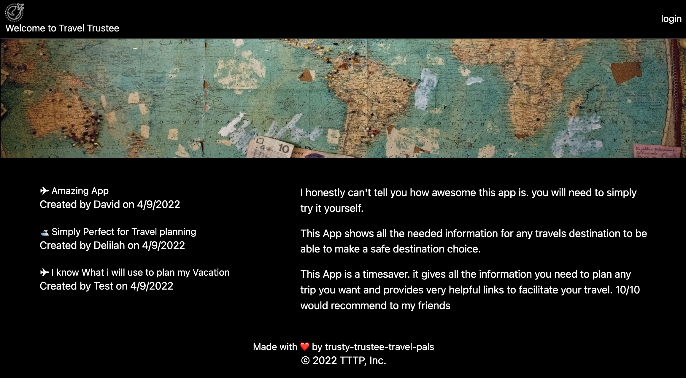
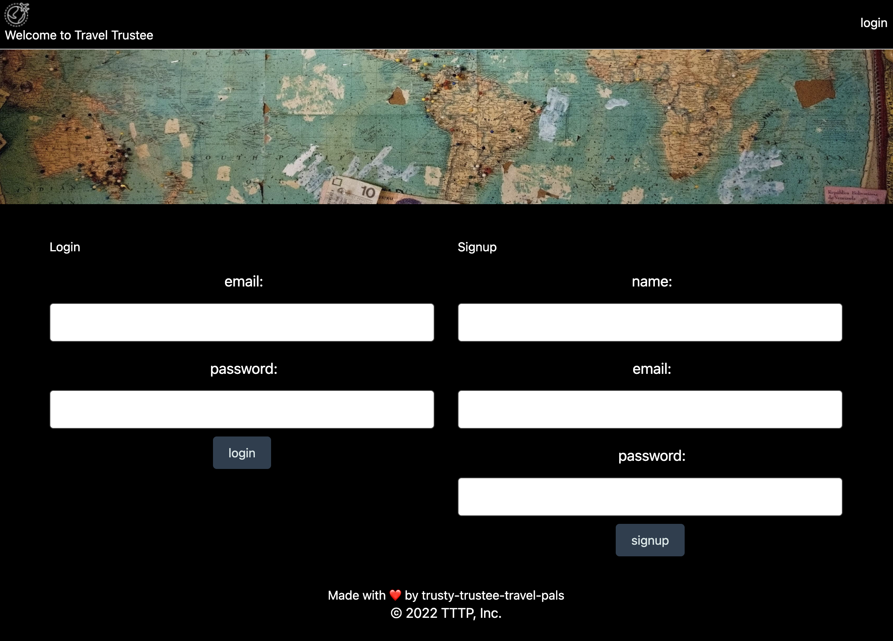
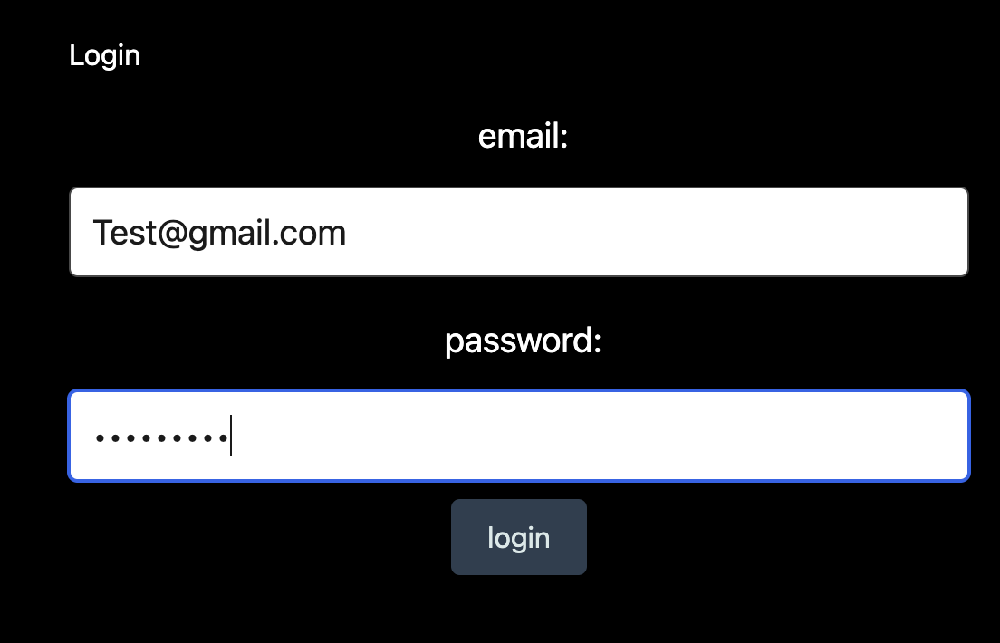
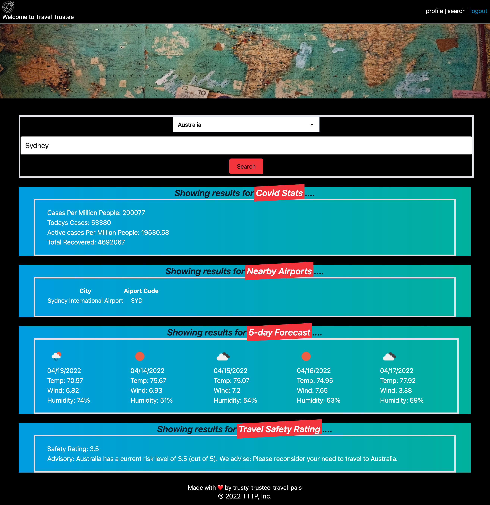

# Trusty Trustee Travel Pals

## GitHub Repository & Deployed Application
* https://github.com/ila0406/Travel-Trustees-2
* https://immense-ravine-97579.herokuapp.com/

## 
* [Description](#description)
* [Technolgies Used](#technolgies-used)
* [Installation Instructions](#installation-instructions)
* [Usage Info](#usage-info)
* [Contribution Guide](#contribution-guide)
* [Instructions for testing](#instructions-for-testing)
* [Questions](#questions)
* [Screenshots](#screenshots) 

## 
This App was built with the intention of being a safety tool for your travel needs. It will pull relevent information for your destination to make your travel a safe and fun trip. If you search for any city in the countries we provided you will be met with a list that includes: * Airports near your destination * Covid cases * Local weather *Country Safety Rating for Travel Previous searches are saved within the user's profile which is behind a login. Safety information for users home location is also saved in profile so they have a comparision when planning their travels. 

## 
* Javascript 
* HTML 
* CSS 
* Tailwinds 
* Node JS 
* bcrypt 
* connect-session-sequelize 
* country-state-city 
* dotenv 
* express 
* express-handlebars 
* express-session 
* mysql2 
* sequelize 
* eslint 
* eslint-config-prettier 
* prettier

## 
1) Run `npm i` to install node packages 
2) Run mysql commands to create and seed databases 
3) Add env file with 
    * `DB_USER=''`
    * `DB_PW=''` 
    * `DB_NAME='travelTrusteeTravelPals_db'`
4) Run  `npm start` to begin program

## 
1) Navigate to db folder in terminal 
2) Login to mysql with `mysql -u root -p` 
3) Run `SOURCE schema.sql` 
4) `quit` mysql server 
5) Run `npm run seed` 
6) Run `npm start`

## 
* Framework code for MVC was taken from previous class activity. 
* Verision 1 of code was refractored from https://github.com/ila0406/Travel-Trustees 
* Received advice and instruction from University of Denver bootcamp Instructors/TAs. 
* Main contributors: Josh Tibbitts, Delilah Haas and David Faidley

## 
* Routes can be tested with Insomonia 
* DB can be tested by running queries directly against seeded DB

## 

### Main

## Login

## Test User

## Results

## 
If you have questions, you can either open a issue in my Github repository  
GitHub: <https://github.com/ila0406>  
 
Or you can us an email directly  
Email: 
* Delilah <ila0406@gmail.com>
* David <david.faidley23@gmail.com>
* Josh<joshtibbetts12@gmail.com>
