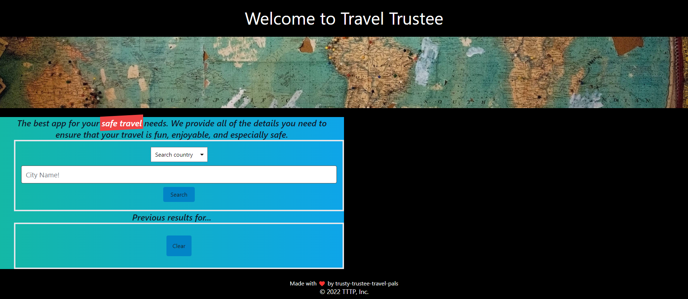
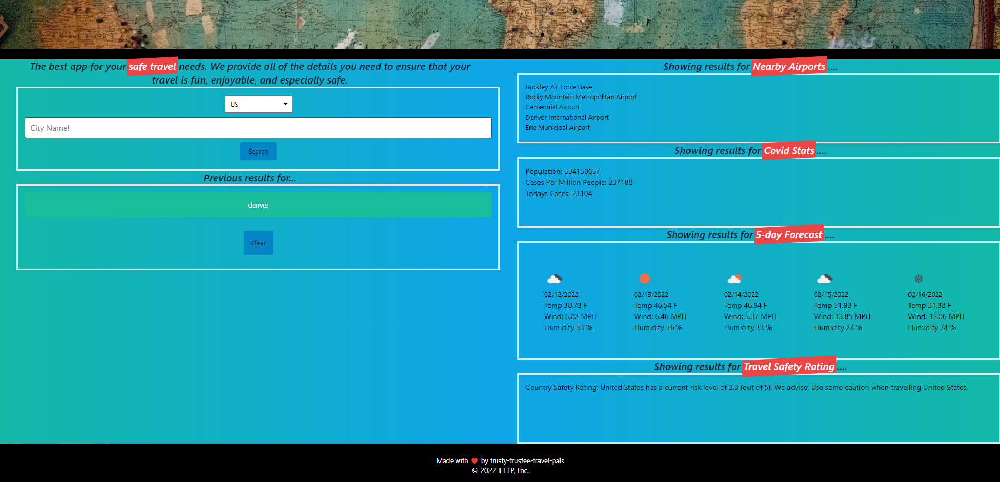

# Travel Trustees
Here is a link to the functioning web page.
- https://ila0406.github.io/Travel-Trustees/

## Description
This App was built with the intention of being a safety tool for your travel needs. It will pull relevent information for your destination to make your travel a safe and fun trip. If you search for any city in the countries we provided you will be met with a list that includes:
- Airports near your destination
- Covid cases
- Local weather
- Country Safety Rating for Travel

## Table of Contents
- [Accessibility](#accessibility)
- [Mockup](#mockup)
- [Usage](#usage)
- [Credits](#credits)

## Technologies Used
CSS, HTML, Javascript, APIs, Moment.js, Tailswind CSS

## User Story
- As a cautious traveler I'd like to go to one website
- Where I will be notified of different categories of safety issues Which will let me make an informed decision on a particular destination.
## Accessibility
Lighthouse report on accesibility

### Mockup

## Usage
This App is meant to be used as a helpful tool for your safe Travels. This will generate the local Covid cases, local airports, the weather, and the air quality near your destination.

## Credits
- Josh Tibbitts
- Delilah Haas (ila0406@gmail.com)
- David Faidley
- DU staff
